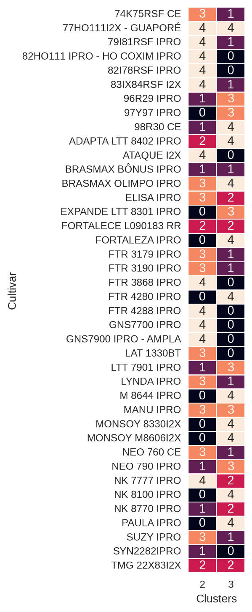

# Temporal Variability in Soybean Sowing and Harvesting Deciphered by K-means and Silhouette Scores

The relationship between the soybean sowing/harvest season and its productivity is one of the most important factors in the selection of cultivars. The farmer wants to select the cultivar that will bring more predictable results, that is, the cultivar that is most stable in relation to variations in temperature and rainfall. Thus, the aim of this study was to evaluate the temporal variability in soybean sowing and harvesting using K-Means clustering and Silhouette Scores. The experimental design followed a randomized block arrangement within a split-plot scheme, with four replications. The plot treatments involved two sowing times (season 1: 10/11/2023, season 2: 04/12/2023), while the subplots included 40 soybean cultivars. At the R8 stage, plants were harvested, and variables such as plant height, insertion of the first pod, number of stems, number of legumes per plant, number of grains per plant, number of grains per pod, mass of a thousand grains, and grain yield were recorded. To implement the K-Means machine learning method, the data is standardization. Afterwards, statistical tests were carried out to verify whether the samples came from different or equal distributions with the same average. These results make it possible to select the variables used in clustering. The application of the proposed methodology makes it possible to select cultivars according to their stability in relation to sowing/harvesting in different seasons, considering different temperatures and rainfall conditions. This contributes to more sustainable agriculture as it reduces costs by selecting more adapted cultivars.

